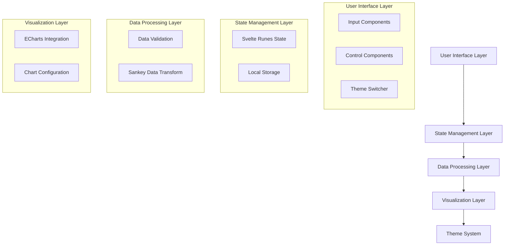

# Design Document

## 🚨 MANDATORY TECHNOLOGY STACK

**CRITICAL: This project MUST use the following stack - NO SUBSTITUTIONS:**

-   **Frontend Framework**: Svelte 5 with runes
-   **Application Framework**: SvelteKit
-   **Runtime & Package Manager**: Bun (NEVER npm/yarn/pnpm)
-   **Build Tool**: Vite (integrated with SvelteKit)
-   **Charting Library**: Apache ECharts
-   **Styling**: Tailwind CSS with dark/light themes
-   **Language**: TypeScript

## Overview

The Sankey Diagram App is a single-page web application built with Svelte 5, utilizing the new runes system for reactive state management. The application provides a real-time interface for creating and visualizing Sankey diagrams, with dynamic data input and immediate visual feedback. The architecture emphasizes performance, reactivity, and user experience through modern web technologies.

**CRITICAL: Technology Stack Requirements**

-   **Frontend Framework**: Svelte 5 with runes (NOT Svelte 4 or earlier)
-   **Application Framework**: SvelteKit for routing and SSR capabilities
-   **Runtime & Package Manager**: Bun (NEVER use npm, yarn, or pnpm)
-   **Build Tool**: Vite (integrated with SvelteKit)
-   **Charting Library**: Apache ECharts for Sankey diagram visualization
-   **Styling Framework**: Tailwind CSS with dark/light theme support
-   **Language**: TypeScript for type safety and better development experience
-   **CSS Processing**: PostCSS with Autoprefixer for browser compatibility

## Architecture

### High-Level Architecture



### Development Commands (MANDATORY - Use Bun Only)

**CRITICAL: All commands MUST use Bun - NEVER use npm, yarn, or pnpm**

```bash
# Install dependencies
bun install

# Start development server
bun run dev

# Build for production
bun run build

# Preview production build
bun run preview

# Type checking
bun run check

# Add new packages
bun add <package-name>

# Remove packages
bun remove <package-name>
```

## Components and Interfaces

### Core Components

#### 1. App Component (`App.svelte`)

-   Root component managing global state and theme
-   Coordinates between input and visualization components
-   Handles theme switching and persistence

#### 2. DataInput Component (`DataInput.svelte`)

-   Manages flow data entry (source, target, value)
-   Provides add/remove functionality for multiple flows
-   Real-time validation and error display

#### 3. SankeyChart Component (`SankeyChart.svelte`)

-   ECharts integration and configuration
-   Real-time chart updates based on data changes
-   Theme-aware chart styling

#### 4. ThemeToggle Component (`ThemeToggle.svelte`)

-   Theme switching interface
-   Visual indicator of current theme
-   Persistence of theme preference

#### 5. ControlPanel Component (`ControlPanel.svelte`)

-   Clear all data functionality
-   Additional chart controls and options

### State Management with Runes

```javascript
// Core application state using Svelte 5 runes
let flows = $state([]);
let theme = $state('dark');
let chartInstance = $state(null);

// Derived state for chart data
let sankeyData = $derived(() => {
    return transformFlowsToSankeyData(flows);
});

// Effects for real-time updates
$effect(() => {
    if (chartInstance && sankeyData) {
        updateChart(chartInstance, sankeyData);
    }
});
```

### Data Models

#### Flow Data Model

```typescript
interface FlowData {
    id: string;
    source: string;
    target: string;
    value: number;
}

interface SankeyNode {
    name: string;
}

interface SankeyLink {
    source: string;
    target: string;
    value: number;
}

interface SankeyChartData {
    nodes: SankeyNode[];
    links: SankeyLink[];
}
```

#### Theme Configuration

```typescript
interface ThemeConfig {
    mode: 'dark' | 'light';
    colors: {
        background: string;
        text: string;
        border: string;
        accent: string;
    };
    chartTheme: EChartsTheme;
}
```

## Components and Interfaces

### Data Flow Architecture

1. **Input Layer**: User enters flow data through form inputs
2. **Validation Layer**: Real-time validation of input data
3. **State Layer**: Reactive state management using Svelte runes
4. **Transform Layer**: Convert flow data to ECharts Sankey format
5. **Visualization Layer**: Render chart using ECharts with theme support

### ECharts Integration

#### Chart Configuration

```javascript
const sankeyOption = {
    series: [
        {
            type: 'sankey',
            data: sankeyData.nodes,
            links: sankeyData.links,
            emphasis: {
                focus: 'adjacency',
            },
            lineStyle: {
                color: 'gradient',
                curveness: 0.5,
            },
        },
    ],
};
```

#### Theme Integration

-   Dynamic theme switching affects both Tailwind classes and ECharts theme
-   Chart colors automatically adapt to selected theme
-   Smooth transitions between theme changes

## Data Models

### Input Validation Rules

-   Source and target must be non-empty strings
-   Value must be a positive number
-   Duplicate flows (same source-target pair) are allowed but flagged
-   Maximum of 50 nodes and 100 connections for performance

### Data Transformation Pipeline

1. **Input Collection**: Gather flow data from form inputs
2. **Validation**: Check data integrity and format
3. **Node Extraction**: Extract unique nodes from source/target values
4. **Link Formation**: Create ECharts-compatible link objects
5. **Chart Data Assembly**: Combine nodes and links for visualization

## Error Handling

### Input Validation Errors

-   Real-time field validation with immediate feedback
-   Clear error messages for invalid data types
-   Visual indicators for problematic fields

### Chart Rendering Errors

-   Graceful fallback for invalid chart data
-   Error boundaries to prevent application crashes
-   User-friendly error messages for chart failures

### Performance Safeguards

-   Debounced input handling to prevent excessive updates
-   Maximum data limits with user warnings
-   Efficient re-rendering using Svelte's reactivity

## Testing Strategy

### Unit Testing

-   Component isolation testing using Vitest
-   State management logic testing
-   Data transformation function testing
-   Theme switching functionality testing

### Integration Testing

-   ECharts integration testing
-   End-to-end user flow testing
-   Theme persistence testing
-   Real-time update functionality testing

### Performance Testing

-   Large dataset rendering performance
-   Memory usage monitoring
-   Update frequency optimization testing

### Browser Compatibility Testing

-   Cross-browser ECharts rendering
-   Tailwind CSS compatibility
-   Local storage functionality across browsers

## Implementation Considerations

### Performance Optimizations

-   Use Svelte's fine-grained reactivity to minimize re-renders
-   Implement debouncing for rapid input changes
-   Lazy loading of ECharts library if needed
-   Efficient data structure updates

### Accessibility

-   Keyboard navigation support
-   Screen reader compatibility for chart data
-   High contrast theme options
-   Focus management for dynamic content

### Responsive Design

-   Mobile-first approach with Tailwind responsive utilities
-   Adaptive chart sizing for different screen sizes
-   Touch-friendly interface elements
-   Collapsible input panels for small screens
